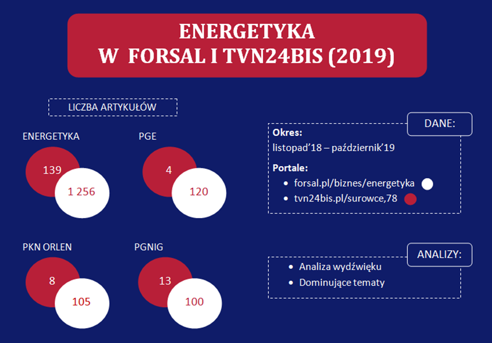
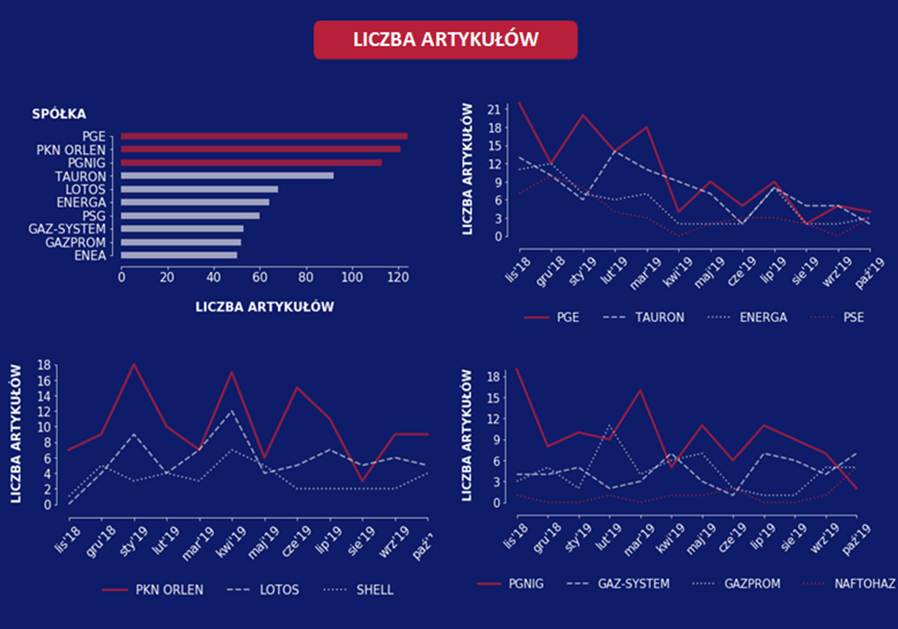
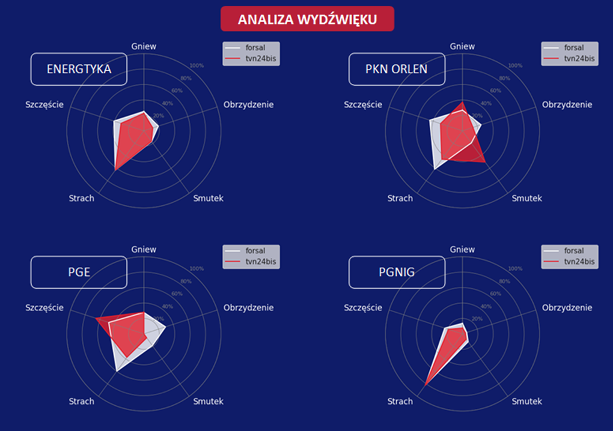
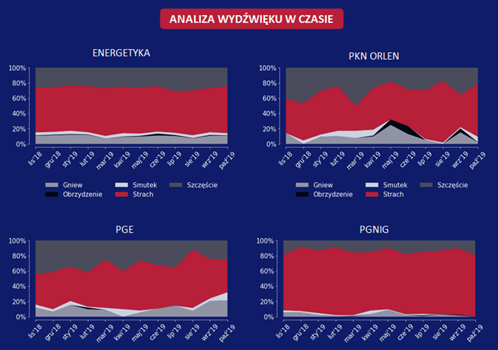
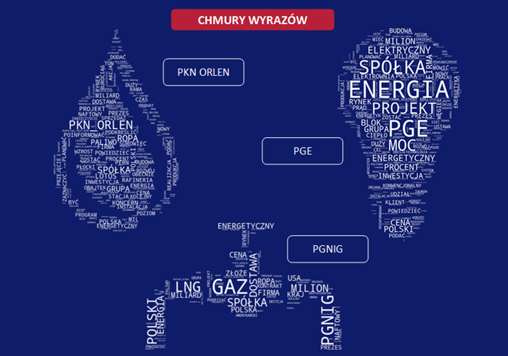
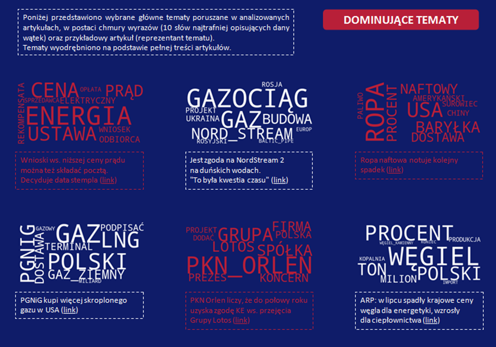

# ENERGETYKA W FORSAL I TVN24BIS (2019)

**DANE:**
* **Okres:** 
  - listopad’18 – październik’19
* **Portale:** 
  - [forsal.pl/biznes/energetyka](https://forsal.pl/biznes/energetyka)
  - [tvn24bis.pl/surowce,78](tvn24bis.pl/surowce,78)

**ANALIZY:**
* **Lematyzacja:** [Morfologik](http://morfologik.blogspot.com/)
* **Analiza wydźwięku:** ["Słownik sentymentu" dla języka polskiego](https://exp.lobi.nencki.gov.pl/nawl-analysis)
* **Topic modeling:** LDA Mallet Model

#

